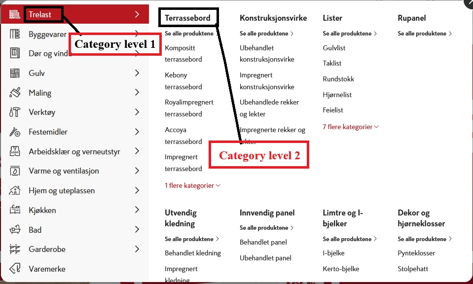

# Scraping tool

This module was created in order to scrape data from a home improvement retailer from Norway.

## Usage

- Clone this repo to your local machine
- Create a python virtual environment
- Install necessary auxiliary libs 

```
pip install -r requirements.txt
```
- Choose category level 1 and category level 2

- Open 'main.py' file, instantiate a ScrapeData object and perform a .run() method on that object
```
from src.run import ScrapeData

if __name__ == '__main__':
    scraper = ScrapeData('trelast', 'terrassebord')
    scraper.run()
```
- Wait for the scraping proccess! Data scraped will be found on filepath: /data/category_level1/category_level2
- Logs can be found on filepath /logs/scraping.log

## Code logic

By instatiating a ScrapeData('category_l1', 'category_l2') object and applying a .run() on it, the following workflow is initiated:

1. ScrapingIds() object is instantiated in order to identify how many listing pages this category/subcategory contains and loop trough them in order to parse all individual 'eans'. A file is created on filepath /data/category_l1/category_l2/products_ids.json. Code can be found on /utils/scraping_ids.py
2. DescriptionEans() object is instantiated to fetch the detailed description of each individual 'ean' found on previous step. Data is stored on filepath /data/category_l1/category_l2/description/{ean}_description.json. Code can be found on /src/get_description/scraping_description.py
3. AvailabilityEans() object is instantiated to fetch the detailed availability of each individual 'ean' found on first step. Data is stored on filepath /data/category_l1/category_l2/availability/{ean}_availability.json. Code can be found on /src/get_availability/scraping_availability.py
4. PriceEans() object is instantiated to fetch the detailed prices of each individual 'ean' found on first step. Data is stored on filepath /data/category_l1/category_l2/prices/{ean}_prices.json. Code can be found on /src/get_prices/scraping_prices.py
5. All errors and important milestones of the code is logged on /logs/scraping.log